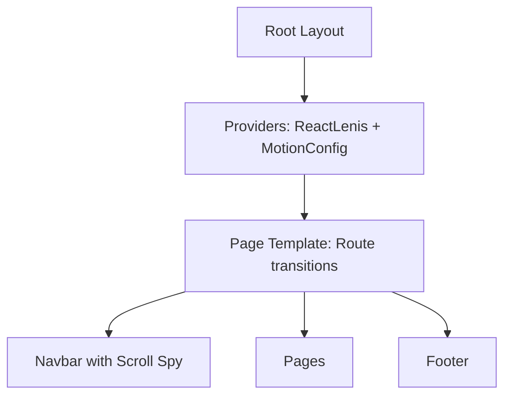
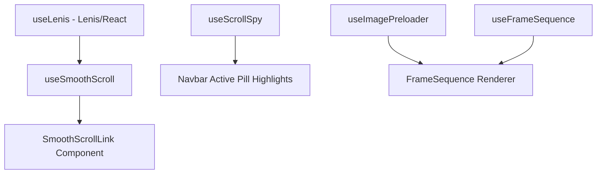

# Implementation Plan 3: Ghib AI SaaS Simplification & Performance Optimization

This document outlines the engineering strategy to convert **Ghib AI** from a SaaS platform into a high-fidelity, portfolio-grade showcase of AI Image Transformations. It provides an actionable blueprint for database refactoring, SaaS codebase cleanup, smooth scrolling and navigation highlights, frame-sequence canvas optimizations, page transitions, and overall performance tuning.

---

## 1. SaaS Removal Strategy

### Goals:
*   Eliminate all payment gateways, billing management, subscription models, monthly limits, and webhook infrastructure.
*   Retain core user accounts, sessions, and conversion history (`renders` table) to maintain a functional workstation demo.
*   Avoid breaking imports and references in shared files.

### Action Items:
1.  **Remove Files**:
    *   `src/app/api/webhooks/polar/route.ts` (Webhook receiver)
    *   `src/components/BillingCheckoutButton.tsx` (Checkout trigger)
    *   `src/actions/billing.ts` (Billing server action)
    *   `src/lib/billing-utils.ts` (Polar signature validation & variant configuration)
    *   `src/app/(dashboard)/billing/page.tsx` (Billing subscription portal page)
    *   `src/actions/usage.ts` (Server action returning usage limits)
    *   `src/actions/auth.ts` (Server action wrapper for initializing usage limits)
    *   `src/lib/user-records.ts` (Usage quota calculation and initialization logic)
2.  **Environment Variable Cleanup**:
    *   Remove variables from `.env` and `.env.example`:
        ```env
        POLAR_ORGANIZATION_NAME
        POLAR_WEBHOOK_SECRET
        POLAR_PRO_VARIANT_ID
        POLAR_STUDIO_VARIANT_ID
        ```
    *   Update `src/lib/env.ts` to remove these schemas from the Zod validator.
3.  **Authentication Config Update**:
    *   Edit `src/lib/auth.ts` to remove the database hook triggering `initializeUserRecords(user.id)` on user registration.
4.  **Middleware Config Update**:
    *   Edit `src/middleware.ts` to remove `/billing` from `PROTECTED_ROUTES` and the matcher config.

---

## 2. Database Refactoring Plan

### Tables to Remove:
*   `subscriptions`
*   `usage`

### Relations to Remove:
*   Remove `subscription` and `usage` relations from the `usersRelations` schema in `src/db/schema.ts`.
*   Delete `subscriptionsRelations` and `usageRelations` definitions from `src/db/schema.ts`.
*   Delete associated types `PlanKey` and `SubscriptionStatus` from `src/db/schema.ts` and their imports across the codebase.

### Schema to Retain:
```ts
// src/db/schema.ts (Retained tables)

import { relations } from 'drizzle-orm';
import {
  boolean,
  index,
  pgTable,
  text,
  timestamp,
} from 'drizzle-orm/pg-core';

export const users = pgTable('users', {
  id: text('id').primaryKey(),
  name: text('name').notNull(),
  email: text('email').notNull().unique(),
  emailVerified: boolean('email_verified').default(false).notNull(),
  image: text('image'),
  createdAt: timestamp('created_at').defaultNow().notNull(),
  updatedAt: timestamp('updated_at').defaultNow().notNull(),
});

export const sessions = pgTable(
  'sessions',
  {
    id: text('id').primaryKey(),
    userId: text('user_id')
      .notNull()
      .references(() => users.id, { onDelete: 'cascade' }),
    token: text('token').notNull().unique(),
    expiresAt: timestamp('expires_at').notNull(),
    ipAddress: text('ip_address'),
    userAgent: text('user_agent'),
    createdAt: timestamp('created_at').defaultNow().notNull(),
    updatedAt: timestamp('updated_at').defaultNow().notNull(),
  },
  (table) => ({
    userIdIdx: index('sessions_user_id_idx').on(table.userId),
  }),
);

export const accounts = pgTable(
  'accounts',
  {
    id: text('id').primaryKey(),
    userId: text('user_id')
      .notNull()
      .references(() => users.id, { onDelete: 'cascade' }),
    providerId: text('provider_id').notNull(),
    accountId: text('account_id').notNull(),
    idToken: text('id_token'),
    accessToken: text('access_token'),
    refreshToken: text('refresh_token'),
    accessTokenExpiresAt: timestamp('access_token_expires_at'),
    refreshTokenExpiresAt: timestamp('refresh_token_expires_at'),
    scope: text('scope'),
    password: text('password'),
    createdAt: timestamp('created_at').defaultNow().notNull(),
    updatedAt: timestamp('updated_at').defaultNow().notNull(),
  },
  (table) => ({
    userIdIdx: index('accounts_user_id_idx').on(table.userId),
  }),
);

export const verificationTokens = pgTable('verification_tokens', {
  id: text('id').primaryKey(),
  identifier: text('identifier').notNull(),
  value: text('value').notNull(),
  expiresAt: timestamp('expires_at').notNull(),
  createdAt: timestamp('created_at').defaultNow().notNull(),
  updatedAt: timestamp('updated_at').defaultNow().notNull(),
});

export const renders = pgTable(
  'renders',
  {
    id: text('id').primaryKey(),
    userId: text('user_id')
      .notNull()
      .references(() => users.id, { onDelete: 'cascade' }),
    sourceImage: text('source_image').notNull(),
    generatedImage: text('generated_image').notNull(),
    style: text('style').notNull(),
    createdAt: timestamp('created_at').defaultNow().notNull(),
  },
  (table) => ({
    userIdIdx: index('renders_user_id_idx').on(table.userId),
  }),
);

export const verifications = verificationTokens;

export const usersRelations = relations(users, ({ many }) => ({
  sessions: many(sessions),
  accounts: many(accounts),
  renders: many(renders),
}));

export const sessionsRelations = relations(sessions, ({ one }) => ({
  user: one(users, {
    fields: [sessions.userId],
    references: [users.id],
  }),
}));

export const accountsRelations = relations(accounts, ({ one }) => ({
  user: one(users, {
    fields: [accounts.userId],
    references: [users.id],
  }),
}));

export const rendersRelations = relations(renders, ({ one }) => ({
  user: one(users, {
    fields: [renders.userId],
    references: [users.id],
  }),
}));
```

---

## 3. Drizzle Migration Plan

### Strategy:
1.  **Drop Constraints and Tables**: We need to drop the table schemas cleanly in a migration without affecting user tables.
2.  **Generate Migration**:
    Run `npx drizzle-kit generate` to let drizzle-kit automatically compare schema modifications and generate the SQL migration file.
3.  **Migration SQL Draft**:
    The generated migration will contain:
    ```sql
    -- Drop indexes associated with subscriptions and usage tables
    DROP INDEX IF EXISTS "subscriptions_user_id_idx";
    DROP INDEX IF EXISTS "usage_user_month_idx";

    -- Drop foreign keys linking subscriptions and usage to users
    ALTER TABLE "subscriptions" DROP CONSTRAINT IF EXISTS "subscriptions_user_id_users_id_fk";
    ALTER TABLE "usage" DROP CONSTRAINT IF EXISTS "usage_user_id_users_id_fk";

    -- Drop tables
    DROP TABLE IF EXISTS "subscriptions";
    DROP TABLE IF EXISTS "usage";
    ```
4.  **Apply Migration**:
    Apply the database schema alterations safely to the local/production databases using `npx drizzle-kit migrate`.

---

## 4. Navigation Enhancement Strategy

### High-Fidelity Navigation Transitions:
Instead of immediate redirects or default HTML hash jumps, landing page clicks must invoke smooth scrolling transitions. Additionally, client-side route routing (Sign In, Sign Up, Dashboard) must prefetch destinations to feel instantaneous.

*   Navbar menu links are simplified to:
    *   **Features** (`#features`)
    *   **Styles** (`#styles`)
    *   **Showcase** (`#showcase`)
    *   **Footer** (`#footer`) (Pricing is removed from menu structures)
*   Integrate the `useLenis` instance directly to command smooth scroll animations.
*   Enable active navbar highlights using an animated Framer Motion layout pill background.

---

## 5. Smooth Scroll Architecture

We implement a reusable hook `useSmoothScroll` that leverages the root Lenis scrolling context to navigate sections with a polished acceleration/deceleration transition.

### `src/hooks/useSmoothScroll.ts`
```typescript
'use client';

import { useLenis } from 'lenis/react';
import { usePathname, useRouter } from 'next/navigation';

export function useSmoothScroll() {
  const lenis = useLenis();
  const router = useRouter();
  const pathname = usePathname();

  const scrollToSection = (targetHash: string) => {
    // If not on the home landing page, navigate to Home first and append hash
    if (pathname !== '/') {
      router.push(`/${targetHash}`);
      return;
    }

    const element = document.querySelector(targetHash);
    if (element && lenis) {
      // Smooth Lenis Scroll transition
      lenis.scrollTo(targetHash, {
        offset: -80, // Offset for the header navbar layout (20 / 5rem = 80px)
        duration: 1.25,
        easing: (t) => Math.min(1, 1.001 - Math.pow(2, -10 * t)), // Exponential Out curve
      });
    } else if (element) {
      // Fallback in case Lenis is not initialized
      element.scrollIntoView({ behavior: 'smooth' });
    }
  };

  return scrollToSection;
}
```

### `src/components/ui/SmoothScrollLink.tsx`
```typescript
'use client';

import React from 'react';
import { useSmoothScroll } from '@/hooks/useSmoothScroll';

interface SmoothScrollLinkProps extends React.AnchorHTMLAttributes<HTMLAnchorElement> {
  href: string;
  children: React.ReactNode;
}

export function SmoothScrollLink({ href, children, className, ...props }: SmoothScrollLinkProps) {
  const scrollToSection = useSmoothScroll();

  const handleClick = (e: React.MouseEvent<HTMLAnchorElement>) => {
    if (href.startsWith('#')) {
      e.preventDefault();
      scrollToSection(href);
    }
  };

  return (
    <a href={href} onClick={handleClick} className={className} {...props}>
      {children}
    </a>
  );
}
```

---

## 6. Scroll Spy System

To track which section is currently active and display a moving background pill in the navigation bar, we build a lightweight viewport observer.

### `src/hooks/useScrollSpy.ts`
```typescript
'use client';

import { useEffect, useState } from 'react';

export function useScrollSpy(selectors: string[], rootMargin = '-30% 0px -60% 0px') {
  const [activeId, setActiveId] = useState<string>('');

  useEffect(() => {
    const observer = new IntersectionObserver(
      (entries) => {
        entries.forEach((entry) => {
          if (entry.isIntersecting) {
            setActiveId(entry.target.id);
          }
        });
      },
      {
        rootMargin,
        threshold: 0,
      }
    );

    selectors.forEach((selector) => {
      const el = document.querySelector(selector);
      if (el) observer.observe(el);
    });

    return () => {
      selectors.forEach((selector) => {
        const el = document.querySelector(selector);
        if (el) observer.unobserve(el);
      });
    };
  }, [selectors, rootMargin]);

  return activeId;
}
```

### Update `src/components/Navbar/index.tsx`
Update navbar to use `useScrollSpy` and Framer Motion's `layoutId` for smooth active pill transition background.

```tsx
// Inside Navbar Component
import { useScrollSpy } from '@/hooks/useScrollSpy';
import { SmoothScrollLink } from '../ui/SmoothScrollLink';

const navItems = [
  { label: 'Features', href: '#features' },
  { label: 'Styles', href: '#styles' },
  { label: 'Showcase', href: '#showcase' },
  { label: 'Footer', href: '#footer' },
];

export function Navbar() {
  const activeId = useScrollSpy(['#features', '#styles', '#showcase', '#footer']);
  // ... existing scroll state triggers ...

  return (
    <nav className="section-shell flex h-20 items-center justify-between gap-4">
      {/* ... logo item ... */}
      <div className="hidden items-center gap-2 rounded-full border border-white/10 bg-white/[0.03] p-1.5 text-sm backdrop-blur-xl md:flex">
        {navItems.map((item) => {
          const isActive = activeId === item.href.substring(1);
          return (
            <SmoothScrollLink
              key={item.href}
              href={item.href}
              className={cn(
                'relative rounded-full px-4 py-2 transition duration-300 font-medium',
                isActive ? 'text-[#050505]' : 'text-muted hover:text-accent',
              )}
            >
              {isActive && (
                <motion.span
                  layoutId="activeNavBg"
                  className="absolute inset-0 -z-10 rounded-full bg-accent"
                  transition={{ type: 'spring', stiffness: 380, damping: 30 }}
                />
              )}
              {item.label}
            </SmoothScrollLink>
          );
        })}
      </div>
      {/* ... auth CTAs ... */}
    </nav>
  );
}
```

---

## 7. Route Transition Architecture

### Page Transitions:
To implement smooth entry page transitions in Next.js 15 App Router without breaking server component performance, we use a root-level `template.tsx`. This component handles entrance mount states whenever routes change.

### `src/app/template.tsx`
```typescript
'use client';

import { motion } from 'framer-motion';

export default function RootTemplate({ children }: { children: React.ReactNode }) {
  return (
    <motion.div
      initial={{ opacity: 0, filter: 'blur(10px)', y: 12 }}
      animate={{ opacity: 1, filter: 'blur(0px)', y: 0 }}
      exit={{ opacity: 0, filter: 'blur(10px)', y: -12 }}
      transition={{
        duration: 0.45,
        ease: [0.16, 1, 0.3, 1], // easeOutExpo
      }}
    >
      {children}
    </motion.div>
  );
}
```

---

## 8. Back Button Experience

### Transition & Scroll Restoration:
Next.js naturally handles scroll restoration. By combining `template.tsx` route animations with proper CSS values, the return trip from:
`Dashboard/Generate` $\rightarrow$ `Home`
triggers a smooth, premium blurred fade-in of the landing page, avoiding rough layout snapping.

```tsx
// Inside src/components/Providers.tsx
// Ensure Framer Motion listens to accessibility settings:
export function Providers({ children }: { children: React.ReactNode }) {
  return (
    <ReactLenis root options={{ lerp: 0.085, duration: 1.15 }}>
      <MotionConfig reducedMotion="user">
        {children}
      </MotionConfig>
    </ReactLenis>
  );
}
```

---

## 9. Landing Page Refinements

### Enhancements:
*   Remove the `<Pricing />` component from the landing layout.
*   Update CTA references to link directly to `/generate`. If the user is unauthenticated, they will be redirected to `/sign-up` and then `/generate` seamlessly.
*   Stagger the reveal animation of sections using a unified viewport trigger.

### `src/components/ui/SectionReveal.tsx`
```typescript
'use client';

import { motion } from 'framer-motion';
import { fadeUp } from '../AnimationVariants';

interface SectionRevealProps {
  children: React.ReactNode;
  id?: string;
  className?: string;
}

export function SectionReveal({ children, id, className }: SectionRevealProps) {
  return (
    <motion.div
      id={id}
      className={className}
      initial="hidden"
      whileInView="visible"
      viewport={{ once: true, amount: 0.15 }}
      variants={fadeUp(0, 0.75)}
    >
      {children}
    </motion.div>
  );
}
```

---

## 10. Frame Sequence Optimization

### Performance Targets (60 FPS):
The Canvas environment must animate seamlessly under heavy scroll pressure without flickering or memory leaks.

### Cache Registry:
In `src/hooks/useImagePreloader.ts`, ensure a static memory cache acts as the singleton registry. If images for a sequence are already parsed, skip background threads entirely and return the state instantly.

### Optimize Rendering:
Refactor `src/hooks/useFrameSequence.ts` to prevent redundant redrawing.
*   Track the `lastIndexRef` and exit early if the incoming frame matches the current painted frame.
*   Optimize resizing events by checking if width/height changed before setting canvas parameters to avoid resets.

```typescript
// Refactored paint checks in useFrameSequence.ts
const drawFrame = (rawIndex: number) => {
  const index = Math.min(images.length - 1, Math.max(0, Math.floor(rawIndex)));
  if (index === lastIndexRef.current) return; // Skip paint if same frame is loaded

  const img = images[index];
  if (!img) return;

  const ctx = canvas.getContext('2d');
  if (!ctx) return;

  // Render on canvas using dynamic aspect ratio cover
  // ...
  lastIndexRef.current = index;
};
```

---

## 11. Performance Optimization Strategy

### Metrics Target:
*   **LCP (Largest Contentful Paint)**: $<1.2\text{s}$
*   **CLS (Cumulative Layout Shift)**: $0.00$
*   **Interaction to Next Paint (INP)**: $<80\text{ms}$

### Actions:
1.  **Fonts Preloading**: Ensure fonts (e.g. *Cormorant Garamond*, *Inter*) are preloaded using `next/font` to eliminate Flash of Unstyled Text (FOUT) and shift events.
2.  **Asset Prefetching**: Use `<Link prefetch={true}>` for the primary routing conversions (`/sign-in`, `/sign-up`, `/generate`).
3.  **Code Splitting**: Dynamically import non-essential dashboard layouts or style showcases:
    ```typescript
    const Comparison = dynamic(() => import('@/components/Comparison').then(mod => mod.Comparison), {
      loading: () => <div className="h-96 animate-pulse bg-white/5" />
    });
    ```

---

## 12. Accessibility Improvements

*   **Keyboard Controls**: Focus rings `focus-ring` must be styled clearly on interactive buttons, links, and form elements.
*   **ARIA Roles**: Canvas renders should have `role="img"` and a descriptive `aria-label` describing the visual state.
*   **Reduced Motion**: Frame sequence preloading should automatically check `prefers-reduced-motion` and disable parallax offsets or heavy transitions, falling back to a static representation or lightweight cross-fade.

---

## 13. SEO Cleanup Plan

### Update Metadata:
Modify `src/app/metadata.ts` to reposition Ghib AI as a standalone art portfolio project.

*   **Title**: `Ghib AI | Portfolio Art Workstation`
*   **Description**: `A high-performance AI Image Workstation transforming imagery into premium anime frames, clay renders, marble sculptures, pixel models, and storybook sketches.`
*   **Metadata tags**: Remove references to polar checkout links, membership pricing tables, and quotas.

---

## 14. Codebase Cleanup Checklist

- [ ] Delete `src/app/api/webhooks/polar/route.ts`
- [ ] Delete `src/actions/billing.ts`
- [ ] Delete `src/lib/billing-utils.ts`
- [ ] Delete `src/components/BillingCheckoutButton.tsx`
- [ ] Delete `src/app/(dashboard)/billing/page.tsx`
- [ ] Delete `src/components/Pricing/index.tsx`
- [ ] Delete `src/actions/usage.ts`
- [ ] Delete `src/actions/auth.ts`
- [ ] Delete `src/lib/user-records.ts`
- [ ] Edit `src/app/page.tsx` to remove `<Pricing />` imports and calls.
- [ ] Edit `src/db/schema.ts` to remove `subscriptions` and `usage` tables and relations.
- [ ] Edit `src/lib/auth.ts` to remove user creation database hook initialization.
- [ ] Edit `src/lib/env.ts` to purge Polar environment variables.
- [ ] Edit `.env` to strip Polar keys.
- [ ] Edit `src/app/(dashboard)/layout.tsx` to remove Billing navigation links.
- [ ] Edit `src/app/(dashboard)/dashboard/page.tsx` to remove usage cards and plan badges, keeping history statistics.
- [ ] Edit `src/app/(dashboard)/account/page.tsx` to remove active billing items.
- [ ] Edit `src/app/(dashboard)/generate/page.tsx` and `GenerateForm.tsx` to remove remaining render counts and checkouts.

---

## 15. Testing Strategy

### Integration Tests:
1.  **Routing**: Validate transitions when moving between `Home` $\rightarrow$ `Sign In` $\rightarrow$ `Workstation`. Verify blur and slide effects.
2.  **Smooth Scrolling**: Click features, styles, and showcase items. Ensure viewport centers on the target with Lenis scroll animations.
3.  **Infinite Generations**: Authenticate a test account, submit an image URL, choose a style, and trigger consecutive generates. Assert that the history record increments without blocking on user limits.
4.  **Database Purge**: Ensure schema creation via Drizzle migrations succeeds against a test PostgreSQL instance.

---

## 16. Production Readiness Checklist

- [ ] Drizzle migrations successfully deployed.
- [ ] Better Auth credentials correctly mapped.
- [ ] Canvas sequences verified at 60 FPS on mobile Chrome and Safari.
- [ ] Accessibility check: `prefers-reduced-motion` settings skip heavy graphics.
- [ ] Core performance scores checked in Lighthouse.

---

## Architecture After Simplification

### Folder Structure
```
d:\Ghib\
├── migrations\                 # Drizzle SQL migration files
├── public\                     # Static canvas assets and OG images
├── src\
│   ├── actions\
│   │   ├── auth.ts             # Auth initialization (dismantled SaaS hooks)
│   │   └── generate.ts         # Photo transformation (unlimited quota)
│   ├── app\
│   │   ├── (auth)\
│   │   │   ├── sign-in\
│   │   │   └── sign-up\
│   │   ├── (dashboard)\
│   │   │   ├── account\
│   │   │   ├── dashboard\
│   │   │   ├── generate\
│   │   │   └── history\
│   │   ├── api\
│   │   │   └── auth\           # Better Auth routes
│   │   ├── globals.css
│   │   ├── layout.tsx
│   │   ├── metadata.ts
│   │   ├── page.tsx
│   │   └── template.tsx        # Framer Motion transitions
│   ├── components\
│   │   ├── ui\
│   │   │   ├── FrameSequence.tsx
│   │   │   ├── SectionReveal.tsx
│   │   │   └── SmoothScrollLink.tsx
│   │   ├── Navbar\
│   │   └── Footer\
│   ├── db\
│   │   ├── index.ts
│   │   └── schema.ts           # Simplified ORM tables
│   ├── hooks\
│   │   ├── useFrameSequence.ts
│   │   ├── useImagePreloader.ts
│   │   ├── useLenis.ts
│   │   ├── useScrollSpy.ts
│   │   └── useSmoothScroll.ts
│   └── lib\
│       ├── auth-client.ts
│       ├── auth.ts
│       ├── env.ts              # Cleaner env mapping
│       ├── store.ts            # Simplified Zustand states
│       └── utils.ts
```

### Component Architecture


### Hook Architecture


### Route Architecture
```
/ (Landing Page - Scroll to #features, #styles, #showcase)
├── /sign-in (Authentication)
├── /sign-up (Authentication)
└── /dashboard (Workspace landing)
    ├── /generate (Workstation generator - Unlimited renders)
    ├── /history (Render gallery log)
    └── /account (User profile details)
```
