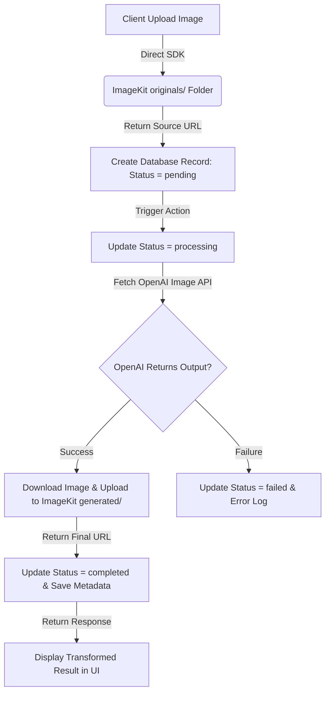

# Production Refactoring & Generation Studio Implementation Plan (Ghib AI)

This document outlines the architecture, pipeline design, API specifications, and database configurations required to implement a robust, production-grade Creative Workstation (Generation Studio) and image transformation pipeline for Ghib AI. 

---

## 1. API Architecture Review
The Ghib AI API layer is responsible for authenticating users, validating inputs, executing the transformation pipeline, managing storage assets, and retrieving logs. 

### Current Limitations:
1. **API Rate Limiting**: The current rate-limiting is implemented in memory (`Map<string, number[]>`), which resets on serverless cold starts. This causes vulnerability to abuse and API cost spikes.
2. **Missing Ownership Isolation**: API endpoints for querying and deleting records lack checks to ensure that a user can only read/write their own records.
3. **CORS and Download Restrictions**: Browsers block direct downloading of images hosted on ImageKit due to CORS policies unless routed through a proxy endpoint.
4. **Error Boundaries**: Next.js server actions do not have standardized catch-all wrappers, causing database connection timeouts or OpenAI errors to bubble up as generic, unhandled 500 errors to the client.

### Target Architecture:
* **Serverless Resilience**: API routes will utilize a shared Drizzle instance with connection pooling configurations suited for serverless Vercel environments.
* **Type-Safe Validation**: All HTTP payloads (request bodies, query params, and URL route parameters) are validated using Zod.
* **Authentication Boundaries**: Session verification is centralized using Better Auth middleware on route endpoints and Server Action helpers.
* **Unified Error Schema**: All API routes and Server Actions return standard JSON envelopes containing `{ success: boolean, data?: T, error?: string }`.

---

## 2. ImageKit Integration Review
ImageKit serves as our media storage engine. The upload pipeline handles two distinct operations: client-side raw source uploads (to reduce server overhead) and server-side generated image storage.

### Current Findings:
* The current `uploadBufferToImageKit` function handles file validation, but the system relies on uploading images to the server first as a data-url/string before sending them to ImageKit. This increases Next.js payload sizes and costs.
* Folder management uses flat paths or a basic `ghib-ai/users/{userId}` structure. 

### Folder Organization Design:
To optimize audits, caching, and storage usage, we enforce a strict nested structure:
```
ghib-ai/
└── users/
    └── {userId}/
        ├── originals/    <-- Raw user source photos (expires in 30 days via ImageKit lifecycle rules)
        ├── generated/    <-- Completed high-quality artistic transformations (kept indefinitely)
        └── thumbnails/   <-- Highly compressed WebP versions (w-150, q-70) for history grid view
```

### Server vs. Client Isolation:
* **Source Uploads**: The client requests a token and signature from `/api/storage/signature`, then uploads directly to ImageKit using the ImageKit frontend SDK. This bypasses the Next.js API layer entirely for raw images.
* **Generated Uploads**: The server downloads the temporary output url from OpenAI, processes the image to extract sizes and dimensions, and uploads it to the `/generated` directory.

---

## 3. OpenAI Integration Review
The `lib/openai.ts` and `lib/services/generation.ts` modules orchestrate image generation.

### Audit Findings:
1. **Model Selection**: Currently hardcoded or restricted to DALL-E. Adding support for models (e.g. DALL-E 2 vs DALL-E 3) requires updates to conditional code rather than configurations.
2. **Client Timeouts**: Generative tasks take up to 15 seconds. If Next.js defaults to a 15-second execution limit on standard routes, functions will crash midway.
3. **OpenAI Cost Guardrails**: DALL-E 3 defaults to generating HD images. A cost-sensitive architecture should default to DALL-E 3 standard quality or support DALL-E 2 depending on user selection.
4. **Multi-Provider Strategy**: We need to abstract model configuration to support future engines (Gemini Imagen, Replicate, Fal.ai) without modifications to `runGenerationPipeline`.

---

## 4. Prompt Engineering Audit & Preset System Improvements
To satisfy the **Identity & Composition Preservation** requirement, the prompts must instruct the image generator to keep all non-stylistic features constant.

### Prompt Quality Issues:
* Generic prompts like "make this anime style" lead to DALL-E hallucinating new subjects, changing camera layouts, and distorting faces.
* Lack of negative prompts results in structural distortion, anatomy errors (extra limbs), and background drift.

### Refactored Preset Architecture:
Every preset contains standard fields mapping to our prompt engineering engine:
* **System Prompt**: Contextually anchors the AI model (e.g. "You are an artist of Studio Ghibli...").
* **Transformation Prompt**: Tells the model how to map the *existing* structure to the *new* medium.
* **Negative Prompt**: Explicitly bans unwanted elements (extra limbs, identity drift, perspective changes).
* **Quality Instructions**: appends rendering quality triggers (clean edges, soft shadows).

---

## 5. Improved Preset Specifications

```typescript
export interface StylePreset {
  id: string;
  name: string;
  description: string;
  systemPrompt: string;
  transformationPrompt: (focus: string) => string;
  negativePrompt: string;
  qualityInstructions: string;
  parameters: {
    quality: 'standard' | 'hd';
    model: string;
    style: 'vivid' | 'natural';
  };
}

export const PRESETS_REGISTRY: Record<string, StylePreset> = {
  anime: {
    id: 'anime',
    name: 'Anime Cel',
    description: 'Clean cel shading with expressive colors and crisp outlines.',
    systemPrompt: 'You are an expert anime background and character illustrator producing polished studio keyframes.',
    transformationPrompt: (focus) => 
      `Restyle the uploaded image as high-end anime cel art. Subject focus: ${focus}. Maintain the exact same camera framing, camera perspective, lighting source, subject proportions, subject pose, clothing style, and background environment. Do not alter the scene layout or add new characters.`,
    negativePrompt: 'photorealistic, 3d render, extra limbs, distorted face, duplicate people, random objects, hallucinated accessories, identity drift, composition changes, camera angle drift, generic textures.',
    qualityInstructions: 'Vibrant color contrast, clean ink outlines, elegant cel shading, high definition anime production style.',
    parameters: { quality: 'hd', model: 'dall-e-3', style: 'natural' }
  },
  clay: {
    id: 'clay',
    name: 'Clay Render',
    description: 'Handcrafted clay texture with sculpted forms and warm depth.',
    systemPrompt: 'You are a claymation lighting artist and digital sculptor focused on realistic handcrafted clay materials.',
    transformationPrompt: (focus) =>
      `Translate the uploaded image into a physical claymation scene. Subject focus: ${focus}. Preserve the exact subject pose, identity, face, composition, clothing, and background structure. Make all objects and surfaces look as though they are sculpted out of colorful modeling clay.`,
    negativePrompt: 'photorealistic, digital painting, line art, sharp edges, extra limbs, duplicate people, random objects, hallucinated details, facial drift, background modification, transparent objects.',
    qualityInstructions: 'Subtle plasticine fingerprints, soft ambient occlusion, realistic clay texture, warm premium studio lighting.',
    parameters: { quality: 'standard', model: 'dall-e-3', style: 'vivid' }
  },
  marble: {
    id: 'marble',
    name: 'Marble Sculpture',
    description: 'Elegant carved-stone portraiture with refined texture and museum lighting.',
    systemPrompt: 'You are a classical sculpture art director translating physical scenes into museum-grade carved stone.',
    transformationPrompt: (focus) =>
      `Translate the uploaded image into an elegant carved marble sculpture. Subject focus: ${focus}. Retain the exact camera perspective, facial anatomy, clothing drapery, pose, and background layout. Render every element in white chiseled marble with stone textures.`,
    negativePrompt: 'colors, paint, line art, plastic look, extra limbs, distorted features, added people, hallucinated accessories, identity change, camera movement.',
    qualityInstructions: 'Chiseled detail, subtle surface veining, soft museum-style lighting, high-resolution stone texture, premium gallery finish.',
    parameters: { quality: 'hd', model: 'dall-e-3', style: 'natural' }
  },
  pixel: {
    id: 'pixel',
    name: 'Pixel Art',
    description: 'Blocky pixel-crafted depth with bright game-like lighting.',
    systemPrompt: 'You are a senior pixel-art and voxel-art director creating highly readable stylized retro game assets.',
    transformationPrompt: (focus) =>
      `Convert the uploaded image into a high-fidelity pixel art scene. Subject focus: ${focus}. Preserve the subject identity, pose, clothing style, framing, and environment layout. Map the shapes, outlines, and lighting onto a clean pixel grid.`,
    negativePrompt: 'smooth gradients, blurry lines, photorealism, high-poly 3d, extra limbs, distorted faces, random objects, identity drift.',
    qualityInstructions: 'Crisp block forms, simplified geometry, readable silhouettes, bright game-like lighting, authentic pixel depth.',
    parameters: { quality: 'standard', model: 'dall-e-3', style: 'vivid' }
  },
  storybook: {
    id: 'storybook',
    name: 'Storybook Illustration',
    description: 'Soft cinematic lighting with polished 3D storybook detail.',
    systemPrompt: 'You are an animated feature art director creating warm, refined storybook frames.',
    transformationPrompt: (focus) =>
      `Transform the uploaded image into a premium storybook-inspired 3D illustration. Subject focus: ${focus}. Preserve the original subject identity, pose, clothing details, and background layout. Apply soft hand-painted textures, warm cinematic lighting, and polished animated-film rendering.`,
    negativePrompt: 'harsh lighting, photorealism, extra limbs, distorted faces, random accessories, duplicate people, scene changes, camera angle drift.',
    qualityInstructions: 'Soft depth, tactile materials, warm cinematic lighting, accurate facial features, clean digital painting edges.',
    parameters: { quality: 'hd', model: 'dall-e-3', style: 'natural' }
  }
};
```

---

## 6. Generation Pipeline Design & Status Flow
The pipeline operates as a sequence of transaction boundaries, tracking status transitions inside the `generations` table to prevent orphaned assets and keep users informed.



### Detailed Pipeline Stages:
1. **User Upload (Client Side)**: Raw file validated (Format: PNG, JPG, JPEG, WEBP; Size: <=5MB). Client requests signed signature, uploads directly to ImageKit `/users/{userId}/originals/{uuid}.png`.
2. **Creation of Record**: DB row created with status `pending`.
3. **Pipeline Ignition**: Next.js Server Action updates status to `processing` and pulls the preset configurations.
4. **AI Processing**: OpenAI is queried via `fetch` with an abort controller set to 30,000ms. If OpenAI errors or times out, the pipeline updates status to `failed` and stores the specific error message.
5. **Storage of Generated Asset**: The server fetches the OpenAI URL, parses its content length, and uploads it to ImageKit `/users/{userId}/generated/{uuid}.png`. A thumbnail is created simultaneously using ImageKit real-time transformation parameters.
6. **Db Completion**: DB record is updated to `completed` with the final image URL, file dimensions, file size, and duration.

---

## 7. Database Integration Plan
Every generation is tracked using the `generations` table. We need to add database integration, indexing, and cleanup routines.

### Database Integration Architecture (Drizzle Schema):
```typescript
import { pgTable, text, integer, timestamp, jsonb, index } from 'drizzle-orm/pg-core';
import { users } from './schema';

export const generationStatusEnum = ['pending', 'processing', 'completed', 'failed'] as const;
export type GenerationStatus = (typeof generationStatusEnum)[number];

export const generations = pgTable(
  'generations',
  {
    id: text('id').primaryKey(),
    userId: text('user_id')
      .notNull()
      .references(() => users.id, { onDelete: 'cascade' }),
    originalImageUrl: text('original_image_url').notNull(),
    generatedImageUrl: text('generated_image_url'),
    style: text('style').notNull(),
    preset: text('preset').notNull(),
    promptUsed: text('prompt_used').notNull(),
    model: text('model').notNull(),
    generationStatus: text('generation_status').$type<GenerationStatus>().default('pending').notNull(),
    generationTime: integer('generation_time'), // in ms
    imageWidth: integer('image_width'),
    imageHeight: integer('image_height'),
    fileSize: integer('file_size'), // in bytes
    errorMessage: text('error_message'),
    provider: text('provider').default('openai').notNull(),
    parameters: jsonb('parameters').default({}).notNull(),
    createdAt: timestamp('created_at').defaultNow().notNull(),
    updatedAt: timestamp('updated_at').defaultNow().notNull(),
  },
  (table) => ({
    userIdIdx: index('generations_user_id_idx').on(table.userId),
    statusIdx: index('generations_status_idx').on(table.generationStatus),
    createdAtIdx: index('generations_created_at_idx').on(table.createdAt),
    userCreatedAtIdx: index('generations_user_created_at_idx').on(table.userId, table.createdAt),
  })
);
```

---

## 8. Generation Studio Page Architecture & Layout
The Generation Studio (`/generate`) will be access-controlled via server-side session checks. The page uses a split panels layout following the product's signature glassmorphic look.

### Page Transition Requirements:
* Clicking the CTA "Generate Now" on the landing page redirects:
  * If authenticated: smooth transition using Framer Motion to `/generate`.
  * If unauthenticated: redirect to `/sign-up`.
* Navigation is handled using Next.js App Router prefetching.

### UI Layout Structure:

```
+---------------------------------------------------------------------------------------------------+
|                                     CREATIVE WORKSTATION                                          |
+------------------------------------------------------+--------------------------------------------+
| LEFT PANEL (Control Panel - 40% Width)               | RIGHT PANEL (Display Area - 60% Width)     |
|                                                      |                                            |
| 1. Upload Section                                    | 1. Image Preview Box                       |
|    +-----------------------------------------------+ |    +-------------------------------------+ |
|    | Drag & Drop Area                              | |    |                                     | |
|    | JPG, PNG, WEBP (Max 5MB)                      | |    |       Transformed Output Box        | |
|    +-----------------------------------------------+ |    |       (Before / After Split view)   | |
|                                                      | |    |                                     | |
| 2. Style Presets Selection                           | |    +-------------------------------------+ |
|    [ Anime ]   [ Clay ]   [ Marble ]                 | |                                            |
|    [ Pixel ]   [ Storybook ]                         | | 2. Output Action Toolbar                   |
|                                                      | |    [ Download ] [ Fullscreen ] [ Copy URL] |
| 3. Model Engine Selection                            | |    [ Regenerate ]                          |
|    (DALL-E 3, DALL-E 2 dropdown)                     | |                                            |
|                                                      | | 3. Workflow Progress Bar                   |
| 4. Focus Guidance prompt box                         | |    +=============================> 100%    |
|    [ Input details / text...                       ] | |                                            |
|                                                      | +--------------------------------------------+
| 5. Action Trigger                                    | 4. User Generation History (Paginated Grid)  |
|    [ GENERATE ARTWORK ] (with active spinner)        |    [ Card ]  [ Card ]  [ Card ]  [ Card ]   |
+------------------------------------------------------+--------------------------------------------+
```

---

## 9. Generation History Integration
The history list displays the user's previous generations below the workstation display area.

### Features:
1. **Keyset Pagination**: To avoid performance bottlenecks under high volumes of user generations, the system queries the database using cursor-based keyset pagination rather than `OFFSET`.
2. **Filters**: Users can filter history cards by style (`anime`, `clay`, `marble`, etc.) and status (`completed`, `failed`).
3. **Card Actions**:
   * **View**: Loads the generation details directly into the workspace active state.
   * **Download**: Direct file fetch proxying to bypass CORS.
   * **Delete**: Removes the database record and sends API requests to ImageKit to delete both `originalImageUrl` and `generatedImageUrl`.

---

## 10. API Route Specifications

### 1. `POST /api/generate`
Triggers the image transformation.
* **Headers**: `Cookie: auth_session=...`
* **Request Body**:
```json
{
  "sourceImage": "https://ik.imagekit.io/ghib-ai/users/123/originals/uuid.png",
  "style": "anime",
  "modelId": "dall-e-3",
  "focus": "A boy wearing a blue jacket"
}
```
* **Success Response (200)**:
```json
{
  "success": true,
  "data": {
    "generationId": "gen_uuid",
    "status": "completed",
    "generatedImageUrl": "https://ik.imagekit.io/ghib-ai/users/123/generated/uuid.png",
    "style": "anime",
    "generationTime": 12500
  }
}
```
* **Error Response (401/429/500)**:
```json
{
  "success": false,
  "error": "Rate limit exceeded. Please wait 1 minute."
}
```

### 2. `GET /api/history`
Retrieves paginated history for the authenticated user.
* **Query Parameters**: `limit` (default 10), `cursor` (ISO timestamp of last item), `style` (optional filter).
* **Success Response (200)**:
```json
{
  "success": true,
  "data": {
    "items": [
      {
        "id": "gen_uuid",
        "style": "clay",
        "createdAt": "2026-06-07T00:00:00.000Z",
        "status": "completed",
        "generatedImageUrl": "https://ik.imagekit.io/ghib-ai/users/123/generated/uuid.png",
        "originalImageUrl": "https://ik.imagekit.io/ghib-ai/users/123/originals/uuid.png"
      }
    ],
    "nextCursor": "2026-06-07T00:00:00.000Z"
  }
}
```

### 3. `GET /api/download`
Proxies image downloads to avoid browser CORS errors.
* **Query Parameters**: `url` (ImageKit output image URL).
* **Process**: Validates the URL parameters (must match the ImageKit endpoint), fetches the remote buffer, and sets the headers:
  `Content-Disposition: attachment; filename="ghib-transformation.png"`
  `Content-Type: image/png`

### 4. `DELETE /api/delete-generation`
Deletes a generation.
* **Request Body**: `{ "generationId": "string" }`
* **Security**: Validates that the record exists and `userId` matches the current session.
* **Process**: Deletes the database record, then calls `imagekit.files.delete` for the registered files in parallel.

---

## 11. Security Audit & Policy Check
* **Payload Size Protections**: Set raw body size limits in Next.js endpoints handling file parsing to prevent memory crashes.
* **Ownership Guard**: Every update or delete operation must check `eq(generations.userId, session.user.id)`.
* **Prompt Injection Sanitization**: Inputs are run through `sanitizePromptInput` to strip code syntax, HTML brackets `<>`, and prompt hijacking keywords.
* **Private API Keys**: Ensure keys like `IMAGEKIT_PRIVATE_KEY` and `OPENAI_API_KEY` are never accessed via variables starting with `NEXT_PUBLIC_`.

---

## 12. Recommended TypeScript Types

```typescript
import { z } from 'zod';
import { generationStatusEnum } from '@/db/schema';

export const generateImageSchema = z.object({
  sourceImage: z.string().url('Source image must be a valid URL.'),
  style: z.enum(['anime', 'clay', 'marble', 'pixel', 'storybook']),
  modelId: z.enum(['dall-e-3', 'dall-e-2']).default('dall-e-3'),
  focus: z.string().max(500).optional(),
});

export type GenerateImageInput = z.infer<typeof generateImageSchema>;

export interface GenerationMetadata {
  width: number | null;
  height: number | null;
  fileSize: number | null;
  duration: number;
}

export interface ApiResponse<T> {
  success: boolean;
  data?: T;
  error?: string;
}
```

---

## 13. Recommended Server Actions

### `generateTransformationAction`
Handles the server-side logic for checking rate limits, updating the status state, and starting the AI pipeline.
```typescript
'use server';

import { headers } from 'next/headers';
import { auth } from '@/lib/auth';
import { generateImageSchema } from '@/types';
import { runGenerationPipeline } from '@/lib/services/generation';

export async function generateTransformationAction(rawInput: unknown) {
  const session = await auth.api.getSession({ headers: await headers() });
  if (!session?.user) {
    return { success: false, error: 'Unauthorized user access' };
  }

  const parsed = generateImageSchema.safeParse(rawInput);
  if (!parsed.success) {
    return { success: false, error: parsed.error.errors[0]?.message ?? 'Invalid inputs' };
  }

  try {
    const generation = await runGenerationPipeline({
      userId: session.user.id,
      sourceImage: parsed.data.sourceImage,
      style: parsed.data.style,
      promptInput: parsed.data.focus,
      modelId: parsed.data.modelId,
    });

    return {
      success: true,
      data: {
        id: generation.id,
        imageUrl: generation.generatedImageUrl,
        status: generation.generationStatus,
      }
    };
  } catch (error) {
    return {
      success: false,
      error: error instanceof Error ? error.message : 'Internal pipeline generation failure'
    };
  }
}
```

---

## 14. Performance Optimization Plan
* **Caching on Client**: ImageKit parameters should include high cache control headers (`Cache-Control: public, max-age=31536000`).
* **Connection Pooling**: Use the Neon connection pooler port (with `sslmode=require`) to prevent connection exhaustion.
* **Thumbnail Strategy**: Render history logs utilizing ImageKit transformations to scale image dimensions down to `w=200` to decrease network load.

---

## 15. Production Readiness Checklist
* [ ] Setup Neon SQL Migration using `drizzle-kit push` or migrations scripts.
* [ ] Verify ImageKit private keys are isolated in the `.env` settings.
* [ ] Configure the ImageKit dashboard lifecycle rule to purge the `ghib-ai/users/*/originals` folder after 30 days.
* [ ] Build test scenarios with corrupted/malformed images to verify pipeline error catch paths.
* [ ] Check Framer Motion layout boundaries for zero layout shifts during before/after image comparison states.
